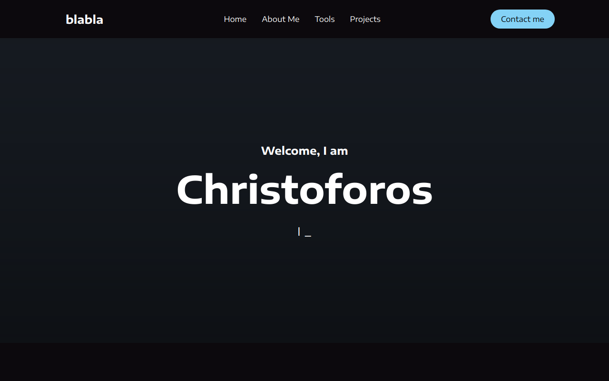

## Personal portfolio

**[Test this app yourself](https://personal-portfolio-v2-react.vercel.app/)**

---

#### Navigation

- About Project
  - _Description_
  - _Developed With_
- How to use this Project
  - _Description_
  - _Developed With_
- Contact
  - _Mail_ 
  - _GitHub_
  - _LinkedIn_
- Used Tools
  - _Fonts_
  - _Design_
  - _Icons_
  - _Colors_

---

# About Project

## Personal portfolio

 Elegant portfolio website to showcase my career, skills and projects
            to the public

### Developed With

- [x] _HTML5_
- [x] _CSS3_
- [ ] _SASS_
- [ ] _SCSS_
- [x] _JavaScript_
- [x] _React_
- [ ] _Bootstrap_
- [x] _npm_
- [x] _Styled-components_

---

### Contact

Mail: <christoforos.choras1@gmail.com> 
GitHub: [Cristoforos choras](https://github.com/CristoforosChoras) 
LinkedIn: [your linkedIn](https://www.linkedin.com/in/christoforos-choras-213220223/)

---

### Used Tools

- [Google Fonts](https://fonts.google.com/)
- [Visual Studio Code](https://code.visualstudio.com/)

---